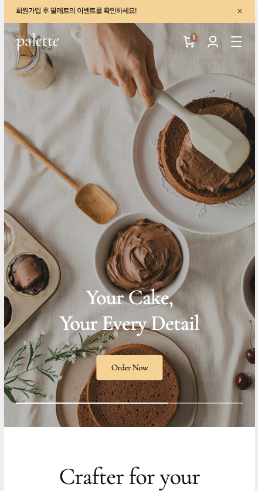
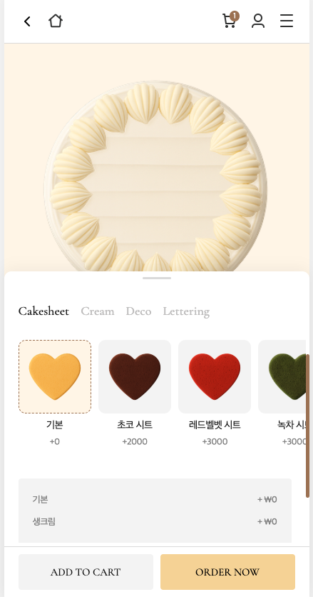
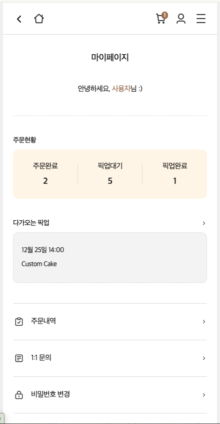

# 🍰 Palette Cake (커스텀 케이크 주문 플랫폼)

> **"당신의 특별한 순간을 디자인하세요"** > Palette Cake는 사용자가 직접 시트, 크림, 토핑을 선택하여 자신만의 케이크를 커스터마이징하고 주문할 수 있는 인터랙티브 웹 애플리케이션입니다.

---

## 🚀 프로젝트 소개
- **목적:** 디자인 에이전시에서의 실무 경험을 바탕으로, 복잡한 사용자 옵션을 직관적인 UI로 구현하고 React 상태 관리를 실무 수준으로 끌어올리기 위한 프로젝트입니다.
- **주요 기능:**
  - 커스텀 케이크 옵션 선택 및 실시간 가격 계산
  - LocalStorage 기반의 장바구니 시스템 (비로그인 대응)
  - 마이페이지 내 주문 내역 및 문의 관리 기능

## 🛠 Tech Stack
- **Frontend:** React, React-Router-DOM
- **State Management:** React Hooks (useState, useEffect)
- **Styling:** CSS3 (Custom Variables 활용), Flex/Grid
- **Deployment:** GitHub Pages

## 💡 주요 기술적 고민 및 해결 (Key Points)

### 1. 컴포넌트 재사용성 극대화
디자인 시스템 가이드를 수립하여 Header, Footer, SideMenu 등 공통 UI를 독립적인 컴포넌트로 분리했습니다. 이를 통해 페이지 추가 시 개발 속도를 약 30% 단축시켰습니다.

### 2. 효율적인 상태 관리 및 데이터 유지
별도의 백엔드 없이도 사용자가 선택한 커스텀 데이터를 유지하기 위해 **LocalStorage**를 활용했습니다. 페이지 새로고침 시에도 장바구니 데이터가 보존되도록 예외 처리를 구현했습니다.

### 3. 사용자 경험(UX) 중심의 UI 구현
- **SideMenu:** 메뉴 클릭 시 자동으로 닫히는 로직과 스크롤 방지 기능을 추가하여 네이티브 앱과 같은 사용성을 제공합니다.
- **Path Naming:** 직관적인 URL 관리를 위해 모든 경력을 `kebab-case`로 통일하고 라우팅 구조를 체계화했습니다.

## 📸 Screen Shots
| 메인 페이지 | 커스텀 페이지 | 마이페이지 |
| :---: | :---: | :---: |
|  |  |  |

---

## 🏁 시작하기
[👉 서비스 바로가기 (Demo Link)](https://palette-six-ecru.vercel.app/)
**Vercel을 통해 배포되었습니다
